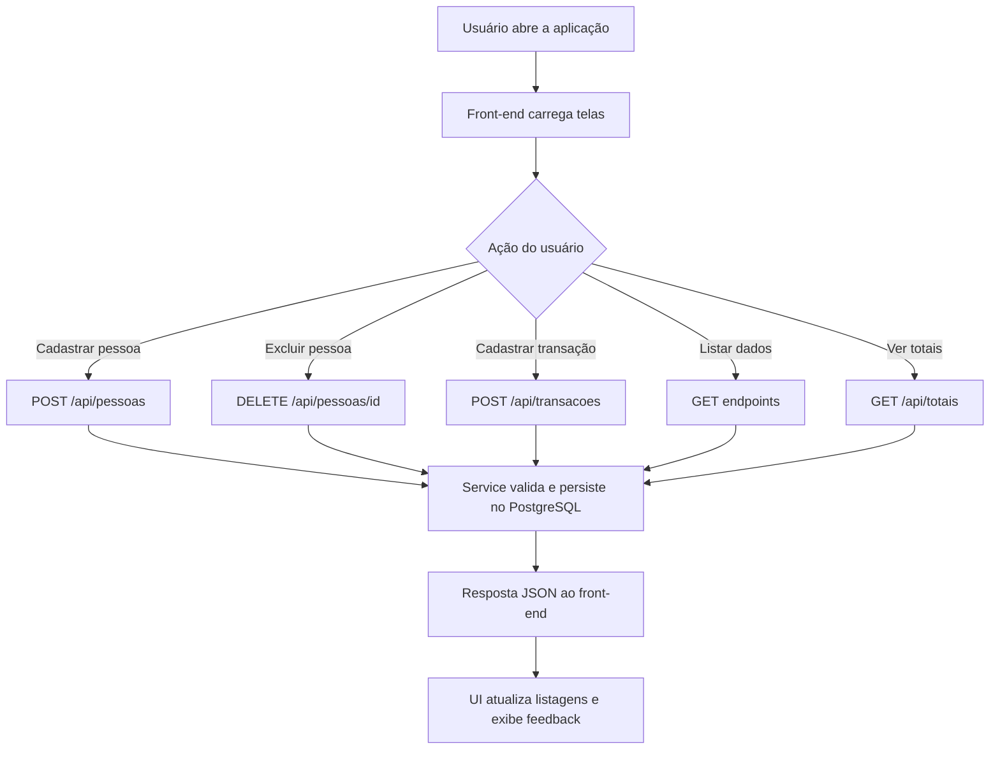
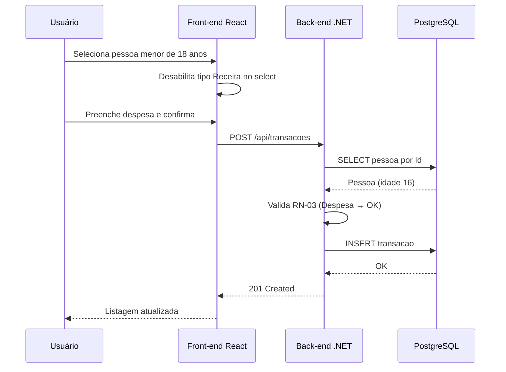
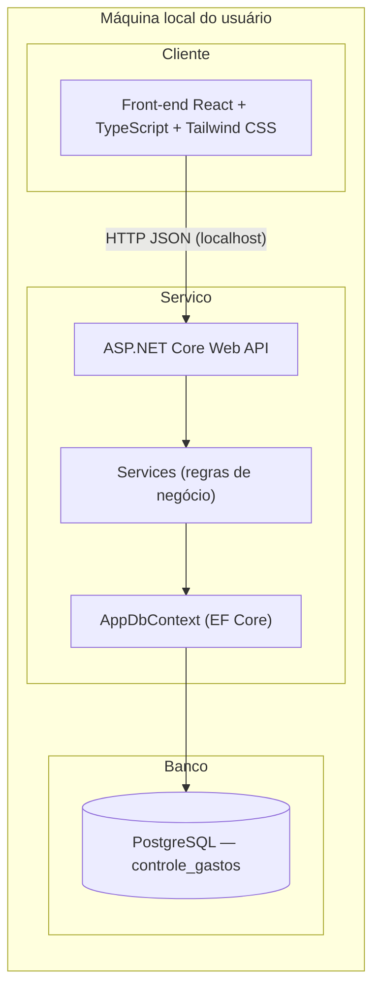
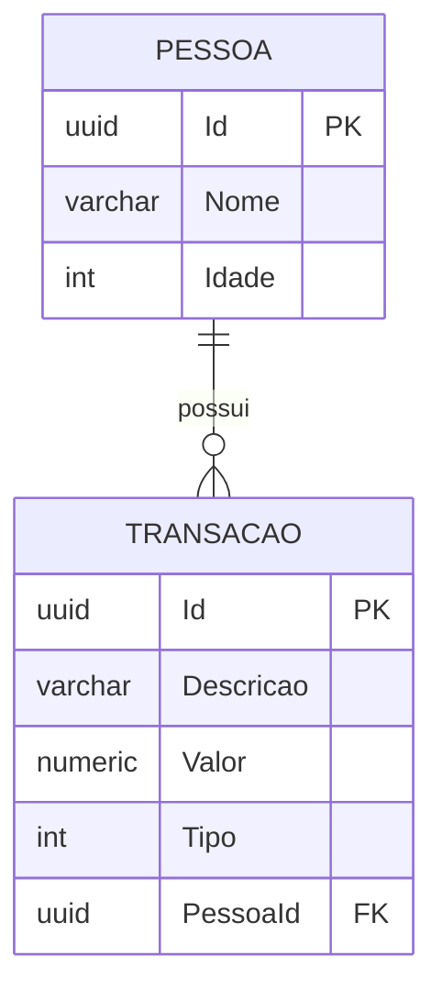

# SDD — Sistema de Controle de Gastos Residenciais

| Campo            | Valor                                      |
| ---------------- | ------------------------------------------ |
| **Versão**       | 1.1                                        |
| **Data**         | 16/07/2026                                 |
| **Status**       | Aprovado para implementação                |
| **Autor**        | Equipe de desenvolvimento                  |
| **Projeto**      | Sistema Residencial — Controle de Gastos   |

---

## Sumário

1. [Visão geral do projeto](#1-visão-geral-do-projeto)
2. [Como o sistema deve ser](#2-como-o-sistema-deve-ser)
3. [Como o sistema funciona](#3-como-o-sistema-funciona)
4. [Stack tecnológica](#4-stack-tecnológica)
5. [Arquitetura do sistema](#5-arquitetura-do-sistema)
6. [Modelo de dados](#6-modelo-de-dados)
7. [Regras de negócio](#7-regras-de-negócio)
8. [Validações](#8-validações)
9. [Comportamentos proibidos — como NÃO deve funcionar](#9-comportamentos-proibidos--como-não-deve-funcionar)
10. [Contrato da API (Backend)](#10-contrato-da-api-backend)
11. [Especificação do Frontend](#11-especificação-do-frontend)
12. [Persistência de dados](#12-persistência-de-dados)
13. [Padrões de código e documentação](#13-padrões-de-código-e-documentação)
14. [Estrutura de pastas](#14-estrutura-de-pastas)
15. [Plano de implementação](#15-plano-de-implementação)
16. [Critérios de avaliação](#16-critérios-de-avaliação)
17. [Anexos](#17-anexos)

---

## 1. Visão geral do projeto

### 1.1 Objetivo

Desenvolver um **sistema local de controle de gastos residenciais**, composto por interface gráfica (React + TypeScript) e serviço de back-end (.NET + C#), permitindo cadastrar pessoas da residência, registrar transações financeiras (receitas e despesas) vinculadas a cada pessoa e consultar totais consolidados por pessoa e gerais.

### 1.2 Problema que resolve

Centralizar o registro de entradas e saídas financeiras de membros de uma residência, com regras específicas por faixa etária e visão consolidada do saldo de cada integrante e do grupo como um todo.

### 1.3 Escopo

| Incluído | Excluído |
| -------- | -------- |
| CRUD parcial de pessoas (criar, listar, excluir) | Edição de pessoa |
| CRUD parcial de transações (criar, listar) | Edição e exclusão de transação |
| Consulta de totais por pessoa e geral | Autenticação / multi-usuário |
| Persistência em PostgreSQL após fechar a aplicação | Publicação em internet / SaaS |
| Documentação e comentários no código | Relatórios exportáveis (PDF/Excel) |
| Interface gráfica local com Tailwind CSS | App mobile nativo |

### 1.4 Metas técnicas

- Back-end REST em **.NET 8** com **C#**
- Front-end em **React 18** com **TypeScript**
- Banco de dados **PostgreSQL 16**
- Estilização exclusivamente com **Tailwind CSS 3**
- Dados persistidos no banco (sobrevivem ao encerramento da aplicação)
- Código legível, comentado e alinhado às regras de negócio
- Separação clara entre camadas (API, domínio, persistência, UI)

---

## 2. Como o sistema deve ser

### 2.1 Natureza da aplicação

O sistema **não é uma aplicação web pública**. É uma **aplicação local cliente-servidor** executada na máquina do usuário:

| Característica | Definição |
| -------------- | --------- |
| **Tipo** | Sistema desktop/local com interface gráfica |
| **Execução** | Back-end e front-end rodam localmente (`localhost`) |
| **Usuários** | Uso single-user, sem login |
| **Rede** | Comunicação interna entre front-end React e API .NET via HTTP local |
| **Persistência** | PostgreSQL instalado localmente (ou via Docker local) |
| **Ciclo de vida** | Dados permanecem no banco após fechar front-end, back-end ou reiniciar o computador |

### 2.2 Forma de uso esperada

1. O usuário inicia o PostgreSQL (serviço local ou container Docker).
2. O usuário inicia o back-end (.NET API).
3. O usuário inicia o front-end (Vite dev server ou build servido localmente).
4. O usuário interage com três áreas funcionais: **Pessoas**, **Transações** e **Totais**.
5. Ao encerrar a aplicação, os dados cadastrados **permanecem** no PostgreSQL.

### 2.3 Requisitos funcionais (enunciado original)

| Módulo | Operações | Campos |
| ------ | --------- | ------ |
| **Pessoas** | Criar, listar, excluir | Id (auto), Nome, Idade |
| **Transações** | Criar, listar | Id (auto), Descrição, Valor, Tipo (despesa/receita), Pessoa (FK) |
| **Totais** | Consultar | Por pessoa: receitas, despesas, saldo; geral: totais consolidados |

### 2.4 Requisito de documentação no código

Toda lógica relevante deve estar **explicitada no código** por meio de:

- Comentários XML (`///`) em métodos e classes do back-end
- Comentários JSDoc em funções e hooks do front-end
- Comentários inline onde a regra de negócio não for óbvia
- README na raiz do projeto com instruções de execução

---

## 3. Como o sistema funciona

### 3.1 Fluxo operacional geral



### 3.2 Fluxo — Cadastro de pessoa

1. Usuário preenche Nome e Idade no formulário da tela Pessoas.
2. Front-end envia `POST /api/pessoas` com `{ nome, idade }`.
3. Back-end valida campos (Seção 8).
4. Back-end gera `Id` (UUID) e insere registro em `pessoas`.
5. Front-end recebe pessoa criada, exibe mensagem de sucesso e atualiza a listagem.

### 3.3 Fluxo — Exclusão de pessoa

1. Usuário clica em Excluir na linha da pessoa.
2. Modal de confirmação informa que **todas as transações** da pessoa serão removidas.
3. Usuário confirma → front-end envia `DELETE /api/pessoas/{id}`.
4. Back-end exclui pessoa; PostgreSQL remove transações vinculadas via `ON DELETE CASCADE`.
5. Front-end atualiza listagens de Pessoas e Transações (se visível).

### 3.4 Fluxo — Cadastro de transação

1. Usuário preenche Descrição, Valor, Tipo e seleciona Pessoa.
2. Se pessoa selecionada tem idade < 18, opção **Receita** fica desabilitada no select (RN-03).
3. Front-end envia `POST /api/transacoes`.
4. Back-end verifica existência da pessoa (RN-02), regra de menor de idade (RN-03) e valor positivo (RN-05).
5. Back-end gera `Id` (UUID) e persiste transação.
6. Front-end atualiza listagem de transações.

### 3.5 Fluxo — Consulta de totais

1. Usuário acessa tela Totais.
2. Front-end chama `GET /api/totais`.
3. Back-end calcula, para **cada pessoa cadastrada** (mesmo sem transações): total de receitas, total de despesas e saldo.
4. Back-end calcula totais gerais somando os valores de todas as pessoas.
5. Front-end renderiza tabela por pessoa e bloco de totais gerais no rodapé.

### 3.6 Diagrama de sequência — Transação com validação de menor



---

## 4. Stack tecnológica

> Todas as tecnologias abaixo são **obrigatórias**. Não há alternativas previstas neste SDD.

### 4.1 Back-end

| Tecnologia | Versão | Uso |
| ---------- | ------ | --- |
| .NET | 8 | Runtime e SDK |
| ASP.NET Core Web API | 8 | API REST local |
| C# | 12 | Linguagem do back-end |
| Entity Framework Core | 8 | ORM, migrations e acesso a dados |
| Npgsql.EntityFrameworkCore.PostgreSQL | 8.x | Provider PostgreSQL para EF Core |
| FluentValidation | 11.x | Validação de DTOs de entrada |
| Swagger (Swashbuckle) | 6.x | Documentação interativa da API em desenvolvimento |

### 4.2 Front-end

| Tecnologia | Versão | Uso |
| ---------- | ------ | --- |
| React | 18 | Biblioteca de interface |
| TypeScript | 5 | Tipagem estática |
| Vite | 5 | Build tool e dev server |
| React Router | 6 | Navegação entre telas |
| Axios | 1.x | Cliente HTTP para comunicação com a API |
| Tailwind CSS | 3 | **Única** biblioteca de estilização |

### 4.3 Banco de dados

| Tecnologia | Versão | Uso |
| ---------- | ------ | --- |
| PostgreSQL | 16 | Persistência relacional dos dados |

### 4.4 Ferramentas de desenvolvimento

| Ferramenta | Uso |
| ---------- | --- |
| Git | Controle de versão |
| dotnet CLI | Build e execução do back-end |
| npm | Gerenciamento de pacotes do front-end |
| Docker (opcional para dev) | Executar PostgreSQL via `docker-compose` |

---

## 5. Arquitetura do sistema

### 5.1 Visão macro



### 5.2 Camadas do back-end

| Camada | Responsabilidade | Artefatos |
| ------ | ---------------- | --------- |
| **Controllers** | Receber HTTP, delegar ao service, retornar status e DTOs | `PessoasController`, `TransacoesController`, `TotaisController` |
| **Services** | Regras de negócio (RN-02 a RN-06), orquestração | `PessoaService`, `TransacaoService`, `TotaisService` |
| **Validators** | Validação de estrutura dos DTOs (FluentValidation) | `CriarPessoaValidator`, `CriarTransacaoValidator` |
| **Data** | DbContext, configuração de entidades, migrations | `AppDbContext`, `Configurations/` |
| **Models** | Entidades de domínio | `Pessoa`, `Transacao`, `TipoTransacao` |
| **DTOs** | Contratos de entrada e saída da API | `CriarPessoaDto`, `PessoaResponseDto`, etc. |
| **Exceptions** | Exceções de domínio mapeadas para HTTP | `BusinessException`, `NotFoundException` |

### 5.3 Camadas do front-end

| Camada | Responsabilidade | Artefatos |
| ------ | ---------------- | --------- |
| **Pages** | Telas completas (Pessoas, Transações, Totais) | `PessoasPage.tsx`, etc. |
| **Components** | UI reutilizável (tabelas, formulários, modal, layout) | `Layout.tsx`, `ConfirmModal.tsx`, etc. |
| **API** | Chamadas HTTP via Axios | `pessoasApi.ts`, `transacoesApi.ts`, `totaisApi.ts` |
| **Types** | Interfaces TypeScript espelhando a API | `pessoa.ts`, `transacao.ts`, `totais.ts` |
| **Hooks** | Lógica de estado e efeitos reutilizáveis | `usePessoas.ts`, `useTransacoes.ts` |

### 5.4 Princípios arquiteturais

| Princípio | Aplicação |
| --------- | --------- |
| **Back-end como fonte da verdade** | Regras de negócio implementadas nos Services; front-end apenas previne erros de UX |
| **Separação de responsabilidades** | Controllers não contêm lógica de negócio; Services não conhecem HTTP |
| **Fail fast** | Validação na entrada; erros retornam imediatamente com mensagem clara |
| **Persistência relacional** | Integridade referencial e cascade no PostgreSQL |
| **Contrato estável** | DTOs definem formato JSON entre front-end e back-end |

---

## 6. Modelo de dados

### 6.1 Entidade `Pessoa`

| Campo | Tipo PostgreSQL | Tipo C# | Obrigatório | Descrição |
| ----- | --------------- | ------- | ----------- | --------- |
| `Id` | `UUID` | `Guid` | Sim | Chave primária, gerada automaticamente (`gen_random_uuid()`) |
| `Nome` | `VARCHAR(100)` | `string` | Sim | Nome da pessoa |
| `Idade` | `INTEGER` | `int` | Sim | Idade em anos completos |

**Constraints de banco:**

- `PK` em `Id`
- `Nome` NOT NULL, CHECK (`LENGTH(TRIM(Nome)) > 0`)
- `Idade` NOT NULL, CHECK (`Idade >= 0 AND Idade <= 150`)

### 6.2 Entidade `Transacao`

| Campo | Tipo PostgreSQL | Tipo C# | Obrigatório | Descrição |
| ----- | --------------- | ------- | ----------- | --------- |
| `Id` | `UUID` | `Guid` | Sim | Chave primária, gerada automaticamente |
| `Descricao` | `VARCHAR(200)` | `string` | Sim | Descrição da transação |
| `Valor` | `NUMERIC(18,2)` | `decimal` | Sim | Valor monetário (sempre positivo) |
| `Tipo` | `INTEGER` | `TipoTransacao` | Sim | `0 = Despesa`, `1 = Receita` |
| `PessoaId` | `UUID` | `Guid` | Sim | FK para `Pessoa.Id` |

**Constraints de banco:**

- `PK` em `Id`
- `Valor` NOT NULL, CHECK (`Valor > 0`)
- `FK PessoaId` → `Pessoa(Id)` **ON DELETE CASCADE**
- Índice em `PessoaId` para consultas de totais

### 6.3 Diagrama ER



### 6.4 Enum `TipoTransacao`

```csharp
/// <summary>
/// Classifica uma transação financeira como entrada (receita) ou saída (despesa).
/// </summary>
public enum TipoTransacao
{
    Despesa = 0,
    Receita = 1
}
```

### 6.5 Nomenclatura no PostgreSQL

| Tabela | Schema |
| ------ | ------ |
| `pessoas` | `public` |
| `transacoes` | `public` |

| Banco | Nome |
| ----- | ---- |
| Database | `controle_gastos` |

---

## 7. Regras de negócio

Todas as regras abaixo **devem** ser implementadas no back-end (fonte da verdade) e refletidas no front-end (UX preventiva).

### RN-01 — Identificadores automáticos

- `Id` de pessoa e transação é gerado pelo sistema (`Guid`/UUID).
- O cliente **não** envia `Id` na criação.
- O `Id` é único e imutável após criação.

### RN-02 — Pessoa deve existir para transação

- Ao cadastrar transação, `PessoaId` informado **deve** existir no cadastro de pessoas.
- Se não existir: retornar `404 Not Found` com mensagem `"Pessoa não encontrada"`.

### RN-03 — Menor de idade: apenas despesas

- Se `Pessoa.Idade < 18`, somente transações do tipo **Despesa** podem ser cadastradas.
- Tentativa de cadastrar **Receita** para menor: retornar `400 Bad Request` com mensagem `"Menores de 18 anos só podem registrar despesas"`.
- A validação usa a idade **atual** da pessoa no momento do cadastro da transação.
- No front-end: ao selecionar pessoa com idade < 18, a opção **Receita** do select de tipo fica **desabilitada**.

### RN-04 — Exclusão em cascata

- Ao excluir uma pessoa, **todas** as transações vinculadas a ela **devem** ser removidas automaticamente.
- Implementação: FK `ON DELETE CASCADE` no PostgreSQL (obrigatório).

### RN-05 — Valor sempre positivo

- `Valor` é armazenado como número **estritamente positivo** (`> 0`).
- O **tipo** (Despesa/Receita) define se o valor entra como saída ou entrada no cálculo de saldo.
- Valores negativos ou zero **não** são aceitos.

### RN-06 — Cálculo de totais

Para **cada pessoa cadastrada** (independente de ter transações):

```
TotalReceitas  = SUM(Valor) WHERE Tipo = Receita
TotalDespesas  = SUM(Valor) WHERE Tipo = Despesa
Saldo          = TotalReceitas - TotalDespesas
```

Totais gerais (exibidos ao final da listagem):

```
TotalGeralReceitas = SUM(TotalReceitas de todas as pessoas)
TotalGeralDespesas = SUM(TotalDespesas de todas as pessoas)
SaldoLiquidoGeral  = TotalGeralReceitas - TotalGeralDespesas
```

### RN-07 — Pessoas sem transações

- Pessoa sem transações **deve** aparecer na consulta de totais com receitas = 0, despesas = 0 e saldo = 0.

### RN-08 — Escopo funcional de CRUD

| Entidade | Criar | Listar | Editar | Excluir |
| -------- | ----- | ------ | ------ | ------- |
| Pessoa | Sim | Sim | **Não** | Sim |
| Transação | Sim | Sim | **Não** | **Não** |

### RN-09 — Persistência após encerramento

- Todos os dados cadastrados **devem** permanecer no PostgreSQL após fechar front-end, back-end ou reiniciar o sistema operacional.
- Nenhum dado de negócio pode ser armazenado apenas em memória volátil.

---

## 8. Validações

### 8.1 Onde cada validação ocorre

| Camada | Responsabilidade |
| ------ | ---------------- |
| **Front-end** | Validação de formulário para UX imediata (campos vazios, valor ≤ 0) |
| **FluentValidation (back-end)** | Validação estrutural dos DTOs |
| **Services (back-end)** | Regras de negócio (RN-02, RN-03, RN-05) |
| **PostgreSQL** | Integridade referencial, CHECK constraints, cascade |

### 8.2 Validações — Pessoa

| Campo | Regra | Camada | HTTP | Mensagem |
| ----- | ----- | ------ | ---- | -------- |
| `Nome` | Obrigatório, não pode ser só espaços | FluentValidation + DB | 400 | `"Nome é obrigatório"` |
| `Nome` | Máximo 100 caracteres | FluentValidation | 400 | `"Nome deve ter no máximo 100 caracteres"` |
| `Idade` | Obrigatória | FluentValidation | 400 | `"Idade é obrigatória"` |
| `Idade` | Inteiro entre 0 e 150 | FluentValidation + DB | 400 | `"Idade deve estar entre 0 e 150"` |
| `Id` | Não enviado na criação | FluentValidation | 400 | `"Id não deve ser informado na criação"` |

### 8.3 Validações — Transação

| Campo | Regra | Camada | HTTP | Mensagem |
| ----- | ----- | ------ | ---- | -------- |
| `Descricao` | Obrigatória, não vazia | FluentValidation | 400 | `"Descrição é obrigatória"` |
| `Descricao` | Máximo 200 caracteres | FluentValidation | 400 | `"Descrição deve ter no máximo 200 caracteres"` |
| `Valor` | Obrigatório | FluentValidation | 400 | `"Valor é obrigatório"` |
| `Valor` | Maior que zero | FluentValidation + DB + Service | 400 | `"Valor deve ser maior que zero"` |
| `Tipo` | Deve ser `Despesa` ou `Receita` | FluentValidation | 400 | `"Tipo inválido"` |
| `PessoaId` | Obrigatório | FluentValidation | 400 | `"Pessoa é obrigatória"` |
| `PessoaId` | Deve existir no cadastro | Service (RN-02) | 404 | `"Pessoa não encontrada"` |
| Tipo + Pessoa | Menor de 18 não pode receita | Service (RN-03) | 400 | `"Menores de 18 anos só podem registrar despesas"` |
| `Id` | Não enviado na criação | FluentValidation | 400 | `"Id não deve ser informado na criação"` |

### 8.4 Validações — Exclusão de pessoa

| Regra | Camada | HTTP | Mensagem |
| ----- | ------ | ---- | -------- |
| `Id` deve existir | Service | 404 | `"Pessoa não encontrada"` |

### 8.5 Formato padrão de erro da API

```json
{
  "mensagem": "Menores de 18 anos só podem registrar despesas",
  "codigo": "MENOR_IDADE_RECEITA"
}
```

### 8.6 Códigos HTTP

| Situação | Código |
| -------- | ------ |
| Leitura bem-sucedida | 200 |
| Criação bem-sucedida | 201 |
| Exclusão bem-sucedida | 204 |
| Validação ou regra de negócio violada | 400 |
| Recurso não encontrado | 404 |
| Erro interno não tratado | 500 |

---

## 9. Comportamentos proibidos — como NÃO deve funcionar

Esta seção define explicitamente o que o sistema **não pode** fazer. Qualquer implementação que permita estes comportamentos está **incorreta**.

### 9.1 Pessoas

| # | Comportamento proibido |
| - | ---------------------- |
| NP-01 | Permitir que o cliente defina o `Id` na criação de pessoa |
| NP-02 | Permitir edição de pessoa (alterar nome ou idade após cadastro) |
| NP-03 | Excluir pessoa sem remover suas transações |
| NP-04 | Cadastrar pessoa com nome vazio ou apenas espaços |
| NP-05 | Cadastrar pessoa com idade negativa ou acima de 150 |
| NP-06 | Duplicar `Id` de pessoa (violando unicidade) |

### 9.2 Transações

| # | Comportamento proibido |
| - | ---------------------- |
| NT-01 | Permitir que o cliente defina o `Id` na criação de transação |
| NT-02 | Permitir edição de transação após cadastro |
| NT-03 | Permitir exclusão individual de transação |
| NT-04 | Cadastrar transação vinculada a pessoa inexistente |
| NT-05 | Cadastrar **Receita** para pessoa com idade < 18 |
| NT-06 | Cadastrar transação com valor zero ou negativo |
| NT-07 | Cadastrar transação sem descrição |
| NT-08 | Armazenar valor negativo invertendo o tipo (ex.: despesa -100 em vez de receita 100) |

### 9.3 Totais

| # | Comportamento proibido |
| - | ---------------------- |
| NG-01 | Omitir pessoa cadastrada da listagem de totais por não ter transações |
| NG-02 | Exibir totais gerais sem incluir receitas, despesas e saldo líquido |
| NG-03 | Calcular saldo como `Despesas - Receitas` (ordem invertida) |
| NG-04 | Calcular totais gerais apenas de pessoas com transações, ignorando as demais |

### 9.4 Persistência e arquitetura

| # | Comportamento proibido |
| - | ---------------------- |
| NA-01 | Armazenar dados apenas em memória (perdidos ao fechar a aplicação) |
| NA-02 | Usar banco diferente de PostgreSQL |
| NA-03 | Implementar regras de negócio **somente** no front-end, sem validação no back-end |
| NA-04 | Publicar o sistema como aplicação web pública acessível na internet |
| NA-05 | Exigir autenticação/login (fora do escopo) |

### 9.5 Front-end

| # | Comportamento proibido |
| - | ---------------------- |
| NF-01 | Usar biblioteca de CSS diferente de Tailwind CSS (CSS Modules, Styled Components, Bootstrap, etc.) |
| NF-02 | Excluir pessoa sem modal de confirmação |
| NF-03 | Permitir seleção de tipo Receita no formulário quando pessoa selecionada é menor de 18 |
| NF-04 | Ocultar mensagem de erro quando a API retorna falha de validação ou regra de negócio |

---

## 10. Contrato da API (Backend)

**Base URL:** `http://localhost:5000/api`

**Formato:** JSON (`Content-Type: application/json; charset=utf-8`)

**Autenticação:** Nenhuma (sistema local single-user)

### 10.1 Pessoas

#### `GET /api/pessoas`

Lista todas as pessoas cadastradas, ordenadas por `Nome` ascendente.

**Response 200:**

```json
[
  {
    "id": "3fa85f64-5717-4562-b3fc-2c963f66afa6",
    "nome": "Maria Silva",
    "idade": 25
  }
]
```

#### `POST /api/pessoas`

Cria uma nova pessoa. O `id` é gerado pelo servidor.

**Request:**

```json
{
  "nome": "Maria Silva",
  "idade": 25
}
```

**Response 201:**

```json
{
  "id": "3fa85f64-5717-4562-b3fc-2c963f66afa6",
  "nome": "Maria Silva",
  "idade": 25
}
```

**Erros:** `400` — validação (Seção 8.2).

#### `DELETE /api/pessoas/{id}`

Exclui pessoa e todas as transações associadas (RN-04).

**Response 204:** sem corpo.

**Erros:** `404` — pessoa não encontrada.

---

### 10.2 Transações

#### `GET /api/transacoes`

Lista todas as transações, incluindo nome da pessoa, ordenadas por `Descricao` ascendente.

**Response 200:**

```json
[
  {
    "id": "7c9e6679-7425-40de-944b-e07fc1f90ae7",
    "descricao": "Supermercado",
    "valor": 150.50,
    "tipo": "Despesa",
    "pessoaId": "3fa85f64-5717-4562-b3fc-2c963f66afa6",
    "pessoaNome": "Maria Silva"
  }
]
```

#### `POST /api/transacoes`

Cria uma nova transação. O `id` é gerado pelo servidor.

**Request:**

```json
{
  "descricao": "Supermercado",
  "valor": 150.50,
  "tipo": "Despesa",
  "pessoaId": "3fa85f64-5717-4562-b3fc-2c963f66afa6"
}
```

**Response 201:** transação criada com `id` gerado.

**Erros:**

- `400` — validação ou RN-03
- `404` — pessoa não encontrada (RN-02)

---

### 10.3 Totais

#### `GET /api/totais`

Retorna totais de **todas** as pessoas cadastradas e totais gerais.

**Response 200:**

```json
{
  "pessoas": [
    {
      "pessoaId": "3fa85f64-5717-4562-b3fc-2c963f66afa6",
      "nome": "Maria Silva",
      "totalReceitas": 3000.00,
      "totalDespesas": 1200.00,
      "saldo": 1800.00
    },
    {
      "pessoaId": "a1b2c3d4-e5f6-7890-abcd-ef1234567890",
      "nome": "João Santos",
      "totalReceitas": 0.00,
      "totalDespesas": 0.00,
      "saldo": 0.00
    }
  ],
  "totaisGerais": {
    "totalReceitas": 5000.00,
    "totalDespesas": 2500.00,
    "saldoLiquido": 2500.00
  }
}
```

---

## 11. Especificação do Frontend

### 11.1 Estilização — Tailwind CSS

- **Toda** estilização visual utiliza classes utilitárias do **Tailwind CSS 3**.
- Arquivo de configuração: `frontend/tailwind.config.js`
- Arquivo de entrada: `frontend/src/index.css` com diretivas `@tailwind base/components/utilities`
- **Proibido** usar CSS Modules, Styled Components, Bootstrap ou CSS puro em arquivos separados por componente (exceto diretivas Tailwind em `index.css`).

### 11.2 Paleta e componentes visuais (Tailwind)

| Elemento | Classes Tailwind de referência |
| -------- | ------------------------------ |
| Layout principal | `min-h-screen bg-gray-50` |
| Cabeçalho / nav | `bg-white shadow border-b border-gray-200` |
| Botão primário | `bg-blue-600 hover:bg-blue-700 text-white px-4 py-2 rounded-md` |
| Botão destrutivo | `bg-red-600 hover:bg-red-700 text-white px-4 py-2 rounded-md` |
| Tabela | `min-w-full divide-y divide-gray-200` |
| Input | `border border-gray-300 rounded-md px-3 py-2 focus:ring-2 focus:ring-blue-500` |
| Saldo negativo | `text-red-600 font-semibold` |
| Mensagem de erro | `text-red-600 text-sm mt-1` |
| Mensagem de sucesso | `text-green-600 text-sm mt-1` |

### 11.3 Rotas / Telas

| Rota | Tela | Descrição |
| ---- | ---- | --------- |
| `/pessoas` | Pessoas | Listagem + formulário de criação + exclusão |
| `/transacoes` | Transações | Listagem + formulário de criação |
| `/totais` | Totais | Tabela por pessoa + bloco de totais gerais |
| `/` | — | Redireciona para `/pessoas` |

Navegação via barra fixa no topo com links Tailwind (`Layout.tsx`).

### 11.4 Tela — Cadastro de Pessoas

**Listagem:**

- Colunas: Nome, Idade, Ações (botão Excluir)
- Tabela estilizada com Tailwind

**Formulário de criação:**

- Campos: Nome (`input type="text"`), Idade (`input type="number"`)
- Botão "Cadastrar" (estilo primário Tailwind)
- Mensagens de erro/sucesso inline abaixo do formulário

**Exclusão:**

- Botão Excluir abre **modal de confirmação** (`ConfirmModal.tsx`)
- Texto do modal: *"Ao excluir esta pessoa, todas as transações vinculadas a ela serão removidas permanentemente. Deseja continuar?"*
- Botões: "Cancelar" e "Confirmar exclusão"

### 11.5 Tela — Cadastro de Transações

**Listagem:**

- Colunas: Descrição, Valor (formatado `R$`), Tipo, Pessoa
- Ordenação: alfabética por Descrição (mesma ordem da API)

**Formulário de criação:**

- Descrição (`input type="text"`)
- Valor (`input type="number"`, step="0.01", min="0.01")
- Tipo (`select`: Despesa / Receita)
- Pessoa (`select` populado via `GET /api/pessoas`)

**Regra RN-03 no front-end:**

- Ao selecionar pessoa com `idade < 18`: opção **Receita** do select fica **desabilitada** (`disabled`)
- Exibir texto auxiliar Tailwind: `"Menores de 18 anos só podem registrar despesas"` (`text-amber-600 text-sm`)

### 11.6 Tela — Consulta de Totais

**Conteúdo:**

- Tabela: Nome, Total Receitas, Total Despesas, Saldo (uma linha por pessoa cadastrada)
- Bloco **Totais Gerais** abaixo da tabela: Total Receitas, Total Despesas, Saldo Líquido
- Valores formatados com `Intl.NumberFormat('pt-BR', { style: 'currency', currency: 'BRL' })`
- Saldo negativo: classe Tailwind `text-red-600 font-semibold`

### 11.7 Tipos TypeScript

```typescript
/** Classificação da transação — espelha enum do back-end */
export type TipoTransacao = 'Despesa' | 'Receita';

export interface Pessoa {
  id: string;
  nome: string;
  idade: number;
}

export interface CriarPessoaDto {
  nome: string;
  idade: number;
}

export interface Transacao {
  id: string;
  descricao: string;
  valor: number;
  tipo: TipoTransacao;
  pessoaId: string;
  pessoaNome: string;
}

export interface CriarTransacaoDto {
  descricao: string;
  valor: number;
  tipo: TipoTransacao;
  pessoaId: string;
}

export interface TotalPorPessoa {
  pessoaId: string;
  nome: string;
  totalReceitas: number;
  totalDespesas: number;
  saldo: number;
}

export interface TotaisResponse {
  pessoas: TotalPorPessoa[];
  totaisGerais: {
    totalReceitas: number;
    totalDespesas: number;
    saldoLiquido: number;
  };
}
```

### 11.8 Cliente HTTP

- Biblioteca: **Axios**
- Instância base: `frontend/src/api/client.ts` com `baseURL: 'http://localhost:5000/api'`
- Interceptor de erro: extrair `mensagem` do corpo JSON e propagar para exibição na UI

---

## 12. Persistência de dados

### 12.1 Estratégia

Utilizar **PostgreSQL 16** como único repositório persistente.

| Parâmetro | Valor |
| --------- | ----- |
| Host | `localhost` |
| Porta | `5432` |
| Database | `controle_gastos` |
| Usuário (dev) | `postgres` |
| Senha (dev) | `postgres` |

> Em produção local, credenciais ficam em `appsettings.Development.json` (back-end) e **não** são commitadas com senhas reais — usar User Secrets ou variáveis de ambiente.

### 12.2 Connection string

```json
{
  "ConnectionStrings": {
    "DefaultConnection": "Host=localhost;Port=5432;Database=controle_gastos;Username=postgres;Password=postgres"
  }
}
```

### 12.3 Configuração EF Core

```csharp
services.AddDbContext<AppDbContext>(options =>
    options.UseNpgsql(configuration.GetConnectionString("DefaultConnection")));
```

### 12.4 Migrations

- Provider: `Npgsql.EntityFrameworkCore.PostgreSQL`
- Migration inicial: tabelas `pessoas` e `transacoes` com constraints da Seção 6
- Aplicação: `Database.Migrate()` no startup do back-end em ambiente Development
- Comando manual: `dotnet ef database update --project ControleGastos.Api`

### 12.5 Docker Compose (desenvolvimento)

Arquivo `docker-compose.yml` na raiz do projeto:

```yaml
services:
  postgres:
    image: postgres:16-alpine
    environment:
      POSTGRES_USER: postgres
      POSTGRES_PASSWORD: postgres
      POSTGRES_DB: controle_gastos
    ports:
      - "5432:5432"
    volumes:
      - pgdata:/var/lib/postgresql/data

volumes:
  pgdata:
```

### 12.6 CORS

- Habilitar CORS no back-end para origem `http://localhost:5173` (Vite dev server)
- Métodos: GET, POST, DELETE
- Headers: Content-Type

---

## 13. Padrões de código e documentação

> **Requisito do teste:** deixar clara a lógica/função do que foi desenvolvido via comentários e documentação no código.

### 13.1 Padrões — Back-end (C#)

| Padrão | Regra |
| ------ | ----- |
| Nomenclatura de domínio | Português: `Pessoa`, `Transacao`, `Despesa`, `Receita` |
| Nomenclatura técnica | Inglês: `Controller`, `Service`, `Repository`, `Dto` |
| Injeção de dependência | Services registrados como `Scoped` no `Program.cs` |
| Async | Métodos de I/O usam `async/await` |
| Exceções | `BusinessException` → 400; `NotFoundException` → 404 |
| Documentação | XML docs (`/// <summary>`) em Services, Controllers e métodos públicos |
| Comentários inline | Apenas em regras de negócio não óbvias (RN-03, RN-06) |

**Exemplo obrigatório de documentação:**

```csharp
/// <summary>
/// Cadastra uma transação vinculada a uma pessoa existente.
/// RN-03: Se a pessoa for menor de 18 anos, apenas despesas são permitidas.
/// RN-02: A pessoa informada deve existir no cadastro.
/// </summary>
public async Task<TransacaoResponseDto> CriarAsync(CriarTransacaoDto dto)
{
    var pessoa = await _context.Pessoas.FindAsync(dto.PessoaId)
        ?? throw new NotFoundException("Pessoa não encontrada");

    // RN-03: menores de idade não podem registrar receitas
    if (pessoa.Idade < 18 && dto.Tipo == TipoTransacao.Receita)
        throw new BusinessException("Menores de 18 anos só podem registrar despesas");

    // ... persistência
}
```

### 13.2 Padrões — Front-end (TypeScript/React)

| Padrão | Regra |
| ------ | ----- |
| Componentes | Function components com hooks |
| Estilização | Exclusivamente Tailwind CSS (classes utilitárias) |
| Estado | `useState` + `useEffect` para fetch; hooks customizados por domínio |
| Tipagem | Interfaces em `src/types/`; sem `any` |
| Documentação | JSDoc em funções de API e hooks customizados |
| Comentários | Breve explicação onde RN-03 é aplicada na UI |
| Formatação | ESLint + Prettier (config padrão Vite React TS) |

### 13.3 Padrões — Banco de dados

| Padrão | Regra |
| ------ | ----- |
| Nomes de tabelas | snake_case plural em português: `pessoas`, `transacoes` |
| Nomes de colunas | PascalCase mapeado via EF ou snake_case — manter consistência via Fluent API |
| Migrations | Versionadas no repositório em `Data/Migrations/` |
| IDs | UUID gerado pelo PostgreSQL (`gen_random_uuid()`) |

### 13.4 Padrões — Git e commits

| Padrão | Regra |
| ------ | ----- |
| Mensagens | Português, imperativo: `"Adiciona cadastro de pessoas"`, `"Implementa RN-03 no service de transações"` |
| Branches | `main` estável; feature branches por módulo |

### 13.5 README.md (obrigatório)

Deve conter:

1. Descrição do projeto
2. Pré-requisitos: .NET 8 SDK, Node 18+, PostgreSQL 16 (ou Docker)
3. Como subir PostgreSQL (`docker-compose up -d`)
4. Como executar back-end (`dotnet run --project backend/ControleGastos.Api`)
5. Como executar front-end (`npm run dev` em `frontend/`)
6. URLs: API `http://localhost:5000`, front-end `http://localhost:5173`, Swagger `http://localhost:5000/swagger`
7. Onde ficam os dados persistidos (PostgreSQL, database `controle_gastos`)

---

## 14. Estrutura de pastas

```
Sistema Residencial/
├── docker-compose.yml            # PostgreSQL local
├── docs/
│   └── SDD.md                    # Este documento
├── backend/
│   ├── ControleGastos.sln
│   └── ControleGastos.Api/
│       ├── Controllers/
│       │   ├── PessoasController.cs
│       │   ├── TransacoesController.cs
│       │   └── TotaisController.cs
│       ├── Services/
│       │   ├── Interfaces/
│       │   │   ├── IPessoaService.cs
│       │   │   ├── ITransacaoService.cs
│       │   │   └── ITotaisService.cs
│       │   ├── PessoaService.cs
│       │   ├── TransacaoService.cs
│       │   └── TotaisService.cs
│       ├── Validators/
│       │   ├── CriarPessoaValidator.cs
│       │   └── CriarTransacaoValidator.cs
│       ├── Data/
│       │   ├── AppDbContext.cs
│       │   ├── Configurations/
│       │   │   ├── PessoaConfiguration.cs
│       │   │   └── TransacaoConfiguration.cs
│       │   └── Migrations/
│       ├── Models/
│       │   ├── Pessoa.cs
│       │   ├── Transacao.cs
│       │   └── TipoTransacao.cs
│       ├── DTOs/
│       ├── Exceptions/
│       │   ├── BusinessException.cs
│       │   └── NotFoundException.cs
│       ├── Program.cs
│       └── appsettings.Development.json
├── frontend/
│   ├── src/
│   │   ├── api/
│   │   │   ├── client.ts
│   │   │   ├── pessoasApi.ts
│   │   │   ├── transacoesApi.ts
│   │   │   └── totaisApi.ts
│   │   ├── components/
│   │   │   ├── Layout.tsx
│   │   │   ├── ConfirmModal.tsx
│   │   │   └── FormMessage.tsx
│   │   ├── hooks/
│   │   │   ├── usePessoas.ts
│   │   │   └── useTransacoes.ts
│   │   ├── pages/
│   │   │   ├── PessoasPage.tsx
│   │   │   ├── TransacoesPage.tsx
│   │   │   └── TotaisPage.tsx
│   │   ├── types/
│   │   │   ├── pessoa.ts
│   │   │   ├── transacao.ts
│   │   │   └── totais.ts
│   │   ├── App.tsx
│   │   ├── main.tsx
│   │   └── index.css           # @tailwind directives
│   ├── tailwind.config.js
│   ├── postcss.config.js
│   ├── package.json
│   └── vite.config.ts
└── README.md
```

---

## 15. Plano de implementação

| Fase | Entrega |
| ---- | ------- |
| **1** | Setup: solução .NET, projeto React + Tailwind, docker-compose PostgreSQL, CORS |
| **2** | Modelo de dados, EF Core + Npgsql, migrations, constraints |
| **3** | API Pessoas (GET, POST, DELETE) + cascade + FluentValidation |
| **4** | API Transações (GET, POST) + RN-02, RN-03, RN-05 |
| **5** | API Totais + RN-06, RN-07 |
| **6** | Front-end: Layout, Pessoas (formulário, listagem, modal exclusão) |
| **7** | Front-end: Transações (select pessoa, RN-03 disable Receita) |
| **8** | Front-end: Totais + formatação moeda pt-BR |
| **9** | README, comentários/XML docs finais, testes manuais |

### 15.1 Checklist de testes manuais

- [ ] Criar pessoa maior e menor de 18 anos
- [ ] Cadastrar receita para maior → sucesso
- [ ] Cadastrar receita para menor → erro RN-03 (API) e opção desabilitada (UI)
- [ ] Cadastrar despesa para menor → sucesso
- [ ] Cadastrar transação com pessoa inexistente → erro RN-02
- [ ] Excluir pessoa com transações → transações removidas do banco e da listagem
- [ ] Pessoa sem transações aparece nos totais com zeros
- [ ] Totais por pessoa corretos
- [ ] Totais gerais = soma de todas as pessoas
- [ ] Fechar front-end e back-end, reabrir → dados persistidos no PostgreSQL
- [ ] Estilização usa exclusivamente Tailwind CSS

---

## 16. Critérios de avaliação

| Critério | Garantia no SDD |
| -------- | --------------- |
| **Aderência às regras de negócio** | Seção 7 (RN-01 a RN-09) + Seção 9 (comportamentos proibidos) |
| **Atenção aos detalhes** | Cascade delete, totais gerais, id auto-gerado, menor só despesa, pessoa sem transação nos totais |
| **Qualidade e legibilidade** | Camadas separadas, DTOs, tipos TS, padrões Seção 13 |
| **Boas práticas** | REST, EF Core, FluentValidation, Tailwind, tratamento de erros, README, comentários no código |

---

## 17. Anexos

### 17.1 Glossário

| Termo | Definição |
| ----- | --------- |
| **Receita** | Entrada de valor (tipo `Receita`) |
| **Despesa** | Saída de valor (tipo `Despesa`) |
| **Saldo** | Receitas − Despesas |
| **Menor de idade** | Pessoa com `Idade < 18` |
| **Sistema local** | Aplicação executada na máquina do usuário, sem publicação web pública |

### 17.2 Decisões técnicas registradas

| Decisão | Valor escolhido | Motivo |
| ------- | --------------- | ------ |
| Banco de dados | PostgreSQL 16 | Requisito do projeto; integridade relacional e persistência robusta |
| Identificador | UUID (`Guid`) | Unicidade global, geração automática pelo banco |
| Estilização | Tailwind CSS 3 | Requisito do projeto; utilitários consistentes |
| Cliente HTTP | Axios | Interceptors, tipagem e tratamento de erro padronizado |
| Validação de DTOs | FluentValidation | Separação clara de validação estrutural vs. regra de negócio |
| Cascade delete | FK `ON DELETE CASCADE` no PostgreSQL | Garantia no banco, independente da aplicação |
| Tipo de aplicação | Cliente-servidor local | Atende escopo do teste sem implicar aplicação web pública |

### 17.3 Comandos de setup

```bash
# PostgreSQL
docker-compose up -d

# Back-end
cd backend
dotnet new sln -n ControleGastos
dotnet new webapi -n ControleGastos.Api
dotnet sln add ControleGastos.Api
dotnet add ControleGastos.Api package Npgsql.EntityFrameworkCore.PostgreSQL
dotnet add ControleGastos.Api package FluentValidation.AspNetCore
dotnet ef migrations add InitialCreate --project ControleGastos.Api
dotnet run --project ControleGastos.Api

# Front-end
cd frontend
npm create vite@latest . -- --template react-ts
npm install
npm install -D tailwindcss postcss autoprefixer
npx tailwindcss init -p
npm install axios react-router-dom
npm run dev
```

### 17.4 Matriz de rastreabilidade — enunciado × SDD

| Requisito do enunciado | Seção do SDD |
| ---------------------- | ------------ |
| Cadastro de pessoas (criar, deletar, listar) | 7 (RN-08), 10.1, 11.4 |
| Campos: Id auto, Nome, Idade | 6.1, 7 (RN-01) |
| Delete pessoa → apaga transações | 7 (RN-04), 9 (NP-03) |
| Cadastro de transações (criar, listar) | 7 (RN-08), 10.2, 11.5 |
| Campos: Id auto, Descrição, Valor, Tipo, Pessoa | 6.2, 7 (RN-01) |
| Menor de 18 → só despesas | 7 (RN-03), 8.3, 9 (NT-05), 11.5 |
| Pessoa deve existir | 7 (RN-02), 9 (NT-04) |
| Consulta de totais por pessoa | 7 (RN-06, RN-07), 10.3, 11.6 |
| Totais gerais no final | 7 (RN-06), 9 (NG-02), 11.6 |
| .NET + C# back-end | 4.1 |
| React + TypeScript front-end | 4.2 |
| Persistência após fechar | 7 (RN-09), 12 |
| Comentários e documentação no código | 2.4, 13 |
| Não é sistema web público | 2.1, 9 (NA-04) |
| PostgreSQL | 4.3, 12 |
| Tailwind CSS | 4.2, 11.1, 9 (NF-01) |

---

**Fim do documento.** Este SDD é a referência oficial para implementação. Qualquer desvio deve ser documentado com justificativa no README.
